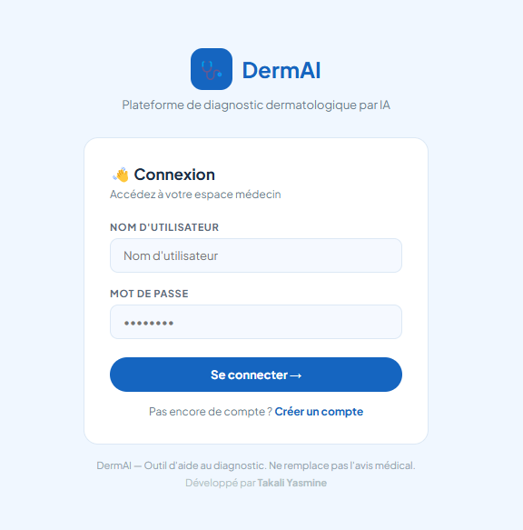
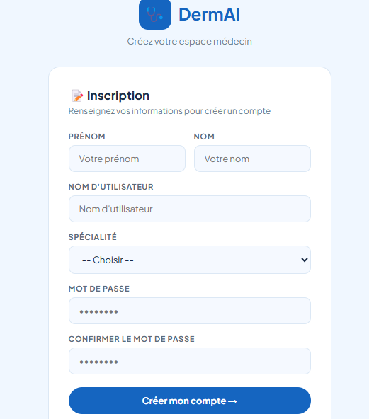
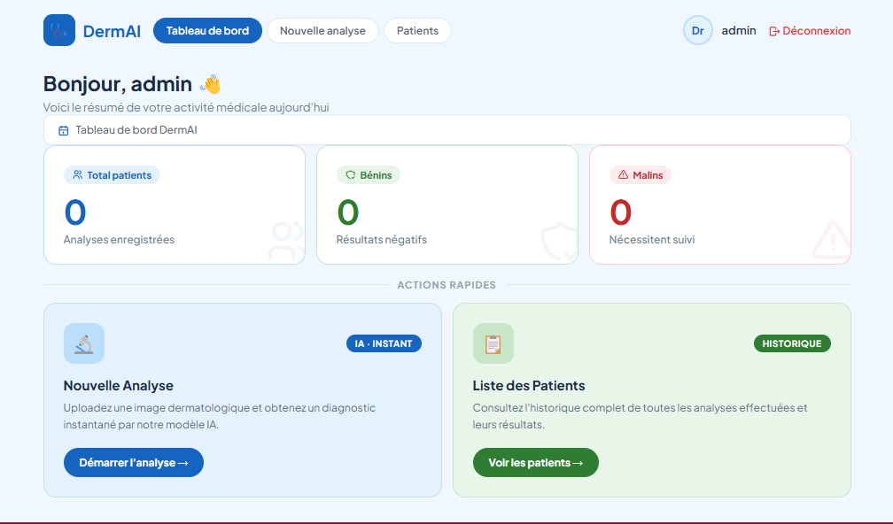
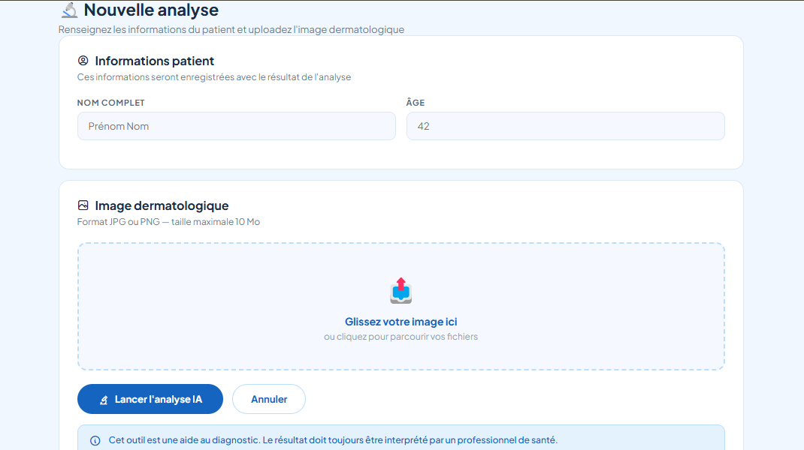
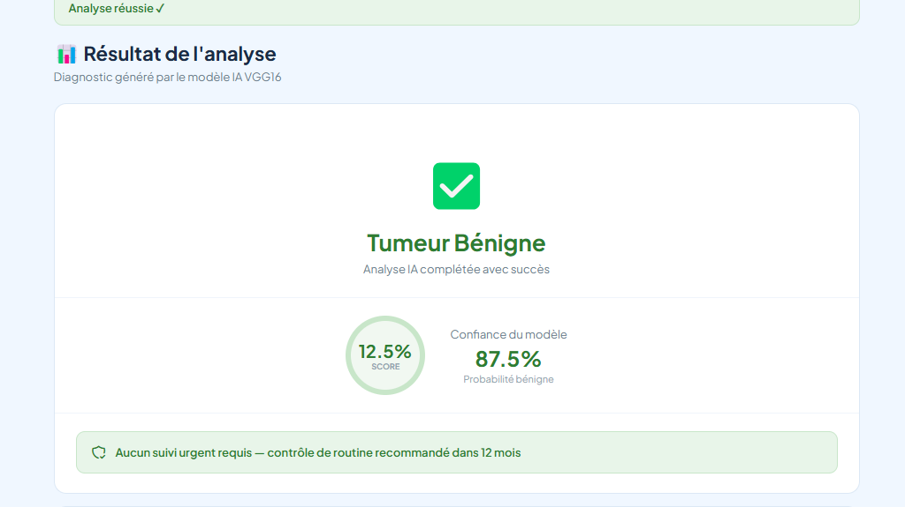
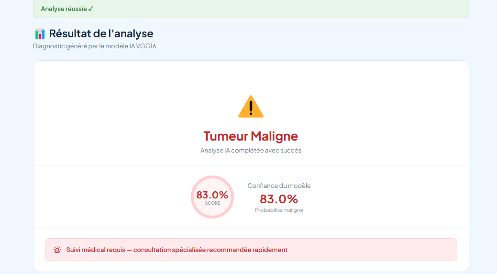
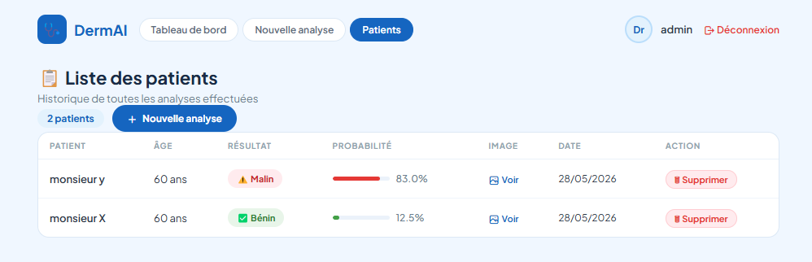

# 🩺 DermAI — Plateforme de Diagnostic Dermatologique par IA

> Développé par **Takali Yasmine**


---

## 📌 Description

DermAI est une application web médicale d'aide au diagnostic dermatologique basée sur l'intelligence artificielle. Elle permet aux médecins de soumettre des images de lésions cutanées et d'obtenir une prédiction **Bénigne** ou **Maligne** grâce à un modèle de deep learning VGG16.

---

## 🎥 Démonstration

[▶️ Cliquez ici pour voir la démonstration](https://drive.google.com/file/d/1ux0E8RSk0rNIv7zsm2voBLxbWLXJkPLy/view?usp=sharing)
> Cliquez sur l'image pour voir la démonstration complète sur Google Drive.

---

## ✨ Fonctionnalités

- 🔐 Authentification sécurisée — Inscription et connexion par médecin
- 🔬 Analyse IA — Upload d'image et diagnostic instantané (Bénin / Malin)
- 📊 Tableau de bord — Statistiques personnalisées par médecin
- 📋 Historique patients — Liste complète des analyses avec probabilités
- 🗑️ Suppression de patients
- 👤 Multi-comptes — Chaque médecin voit uniquement ses propres patients

---

## 🖥️ Captures d'écran

### Page de Connexion


### Page d'Inscription


### Tableau de Bord


### Nouvelle Analyse


### Résultat Bénin


### Résultat Malin


### Liste des Patients


---

## 🏗️ Structure du projet

```
DermAI/
├── app.py
├── README.md
├── screenshots/
│   ├── login.png
│   ├── register.png
│   ├── dashboard.png
│   ├── predict.png
│   ├── result_benign.png
│   ├── result_malignant.png
│   ├── patients.png
│   └── demo.mp4
├── model/
│   └── vgg16_skin_cancer.h5
├── static/
│   └── uploads/
├── templates/
│   ├── base.html
│   ├── login.html
│   ├── register.html
│   ├── dashboard.html
│   ├── predict.html
│   ├── patients.html
│   └── result.html
└── venv/
```

---

## 🧠 Modèle IA — VGG16

Le modèle est basé sur **VGG16** pré-entraîné sur ImageNet, avec fine-tuning pour la classification binaire de lésions cutanées.

| Paramètre | Valeur |
|---|---|
| Architecture | VGG16 (Transfer Learning) |
| Taille d'entrée | 224 × 224 × 3 |
| Classes | Bénin / Malin |
| Activation sortie | Sigmoid |
| Fonction de perte | Binary Crossentropy |
| Optimiseur | Adam |
| Seuil de décision | 0.5 |

---

## 📊 Matrice de Confusion

```
                 Prédiction
                 Bénin      Malin
Réel  Bénin  [   TN    |    FP   ]
      Malin  [   FN    |    TP   ]
```

| Métrique | Description |
|---|---|
| TP | Malin prédit comme Malin ✅ |
| TN | Bénin prédit comme Bénin ✅ |
| FP | Bénin prédit comme Malin ⚠️ |
| FN | Malin prédit comme Bénin ❌ |

---

## 🗄️ Base de données MySQL

### Table `users`
```sql
CREATE TABLE users (
    id          INT AUTO_INCREMENT PRIMARY KEY,
    firstname   VARCHAR(100),
    lastname    VARCHAR(100),
    username    VARCHAR(100) UNIQUE NOT NULL,
    specialty   VARCHAR(100),
    password    VARCHAR(255) NOT NULL
);
```

### Table `patients`
```sql
CREATE TABLE patients (
    id          INT AUTO_INCREMENT PRIMARY KEY,
    name        VARCHAR(100) NOT NULL,
    age         INT,
    result      VARCHAR(20),
    probability FLOAT,
    image_path  VARCHAR(255),
    username    VARCHAR(100),
    created_at  TIMESTAMP DEFAULT CURRENT_TIMESTAMP
);
```

---

## ⚙️ Installation

### Prérequis
- Python 3.8+
- XAMPP (Apache + MySQL)
- pip

### Étapes

**1. Cloner le projet**
```bash
git clone https://github.com/votre-username/DermAI.git
cd DermAI
```

**2. Installer les dépendances**
```bash
pip install flask tensorflow mysql-connector-python numpy
```

**3. Configurer la base de données**
- Lancer XAMPP → démarrer Apache et MySQL
- Ouvrir `http://localhost/phpmyadmin`
- Créer une base de données `skin_cancer_db`
- Exécuter les requêtes SQL ci-dessus

**4. Créer le dossier uploads**
```bash
mkdir -p static/uploads
```

**5. Lancer l'application**
```bash
python app.py
```

**6. Ouvrir dans le navigateur**
```
http://localhost:5000
```

---

## 🛠️ Technologies utilisées

| Technologie | Rôle |
|---|---|
| Python 3 | Langage principal |
| Flask | Framework web backend |
| TensorFlow / Keras | Modèle de deep learning |
| VGG16 | Architecture CNN (Transfer Learning) |
| MySQL | Base de données |
| XAMPP | Serveur local |
| HTML / CSS | Interface utilisateur |

---

## ⚠️ Limitations connues

### Précision sur images hors dataset
Le modèle a été entraîné sur des **images dermoscopiques** prises avec un dermatoscope et du gel conducteur. Les photos classiques prises avec un smartphone donnent des résultats moins fiables car la qualité d'éclairage et l'angle sont différents.

### Faux positifs sur grains de beauté foncés
Le modèle tend à classer certains grains de beauté bénins comme malins lorsque leur couleur est brun foncé, car il associe les tons sombres au mélanome. Le seuil de décision peut être ajusté selon les besoins.

### Compatibilité TensorFlow / Keras
Lors du développement, des problèmes de compatibilité entre les versions de TensorFlow et Keras ont été rencontrés. Le modèle doit être chargé avec `compile=False` pour éviter les erreurs de configuration :
```python
model = load_model("model/vgg16_skin_cancer.h5", compile=False)
```

### Connexion MySQL
Une connexion MySQL globale provoque des erreurs après plusieurs heures d'inactivité (`MySQL server has gone away`). Ce problème a été résolu en créant une connexion locale à chaque requête via la fonction `get_db()`.

---

## ⚕️ Avertissement médical

Cet outil est une aide au diagnostic uniquement. Les résultats générés par le modèle ne remplacent en aucun cas l'avis d'un dermatologue ou d'un professionnel de santé qualifié.

---

## 📄 Licence

Ce projet est réalisé dans un cadre académique par **Takali Yasmine**.
